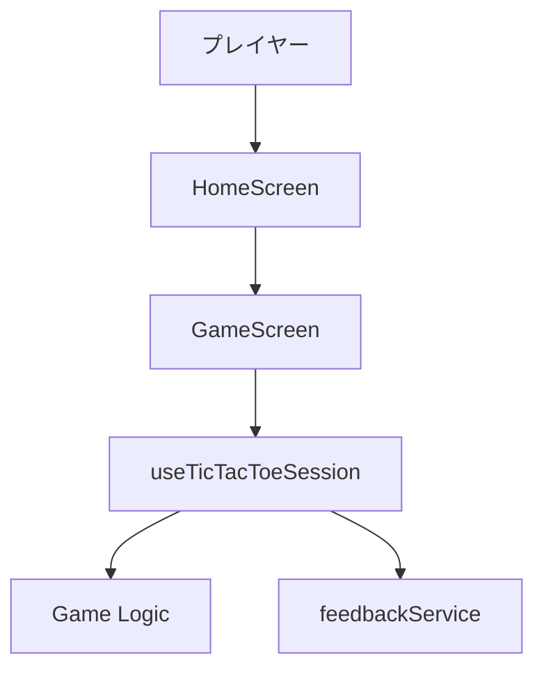
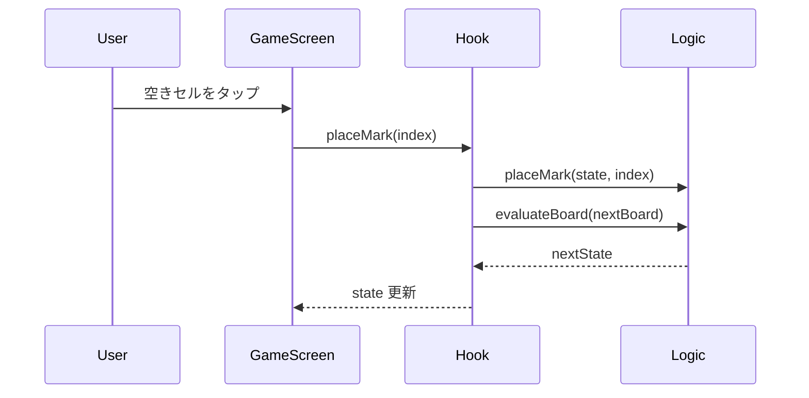
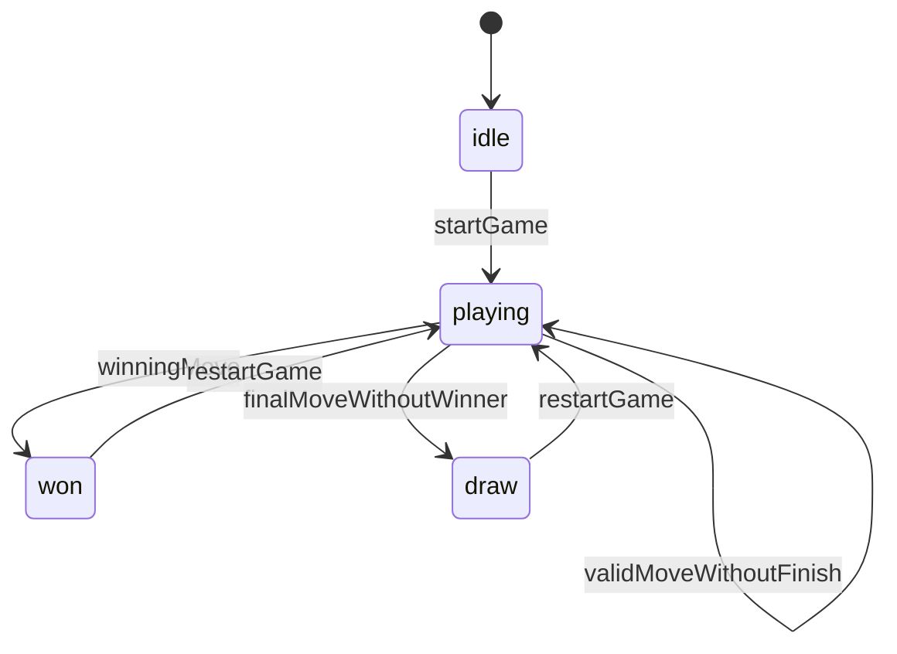

# 機能設計書 (Functional Design Document)

## 対象範囲

- 本書が扱う MVP 範囲: ホーム画面からの対戦開始、3x3 盤面での交互プレイ、勝敗判定、引き分け判定、再戦
- 対象外: オンライン対戦、CPU 対戦、スコア永続化、ユーザー登録、通知
- 将来拡張: プレイヤー名設定、先手切替、サウンド/触覚設定、スコアボード

## システム構成図



## 技術スタック

| 分類 | 技術 | 選定理由 |
|------|------|----------|
| 言語 | JavaScript (ES2022) | Expo managed workflow の標準前提に合わせ、導入初期の複雑さを減らす |
| フレームワーク | React Native + Expo | 単一コードベースで iOS / Android のローカルゲーム体験を実装できる |
| unit test | Jest | Expo managed workflow と相性の良い公式寄りの test 基盤として運用しやすい |
| component test | `@testing-library/react-native` | Jest と組み合わせて、盤面タップや結果表示など UI フローをユーザー操作に近い形で確認できる |

## データモデル定義

### エンティティ: CellModel

```javascript
/**
 * @typedef {'X' | 'O' | null} Mark
 */

/**
 * @typedef {Object} CellModel
 * @property {number} index
 * @property {Mark} mark
 * @property {boolean} isWinningCell
 */
```

**制約**:
- `index` は 0 から 8 の整数とする
- `mark` は一度確定したら、再戦するまで変更しない

### エンティティ: GameSessionState

```javascript
/**
 * @typedef {'idle' | 'playing' | 'won' | 'draw'} GameStatus
 */

/**
 * @typedef {Object} GameSessionState
 * @property {CellModel[]} board
 * @property {'X' | 'O'} currentPlayer
 * @property {GameStatus} status
 * @property {'X' | 'O' | null} winner
 * @property {number[] | null} winningLine
 * @property {string | null} message
 */
```

**制約**:
- `board` は常に 9 件の `CellModel` を持つ
- `status` が `won` の場合は `winner` と `winningLine` が必ず埋まり、`draw` の場合は `winner` が `null` になる

## コンポーネント設計

### HomeScreen

**責務**:
- アプリのタイトルと開始導線を表示する
- 新しい対戦開始アクションを受け取って `GameScreen` へ遷移させる

**インターフェース**:
```javascript
/**
 * @typedef {Object} HomeScreenProps
 * @property {() => void} onStartGame
 */
```

**依存関係**:
- `shared/components/PrimaryButton`
- `app/navigation`

### GameScreen

**責務**:
- 盤面、手番、結果メッセージ、再戦操作を表示する
- セルタップを `useTicTacToeSession` に渡す

**インターフェース**:
```javascript
/**
 * @typedef {Object} GameScreenProps
 * @property {() => void} onExit
 */
```

**依存関係**:
- `tic-tac-toe/components/GameBoard`
- `tic-tac-toe/hooks/useTicTacToeSession`
- `shared/components/ScreenContainer`

### GameBoard

**責務**:
- 3x3 の盤面セルを描画する
- 無効状態のセルや勝ち筋セルの見た目を反映する

**インターフェース**:
```javascript
/**
 * @typedef {Object} GameBoardProps
 * @property {CellModel[]} board
 * @property {boolean} disabled
 * @property {(index: number) => void} onCellPress
 */
```

**依存関係**:
- `tic-tac-toe/components/MarkCell`
- `shared/theme`

### useTicTacToeSession

**責務**:
- ゲーム状態の単一ソースとして振る舞う
- セル選択、勝敗判定、再戦、演出呼び出しの順序を制御する

**インターフェース**:
```javascript
/**
 * @typedef {Object} TicTacToeSessionResult
 * @property {GameSessionState} state
 * @property {(index: number) => void} placeMark
 * @property {() => void} restartGame
 */
```

**依存関係**:
- `tic-tac-toe/logic/createInitialState`
- `tic-tac-toe/logic/placeMark`
- `tic-tac-toe/logic/evaluateBoard`
- `tic-tac-toe/services/feedbackService`

### feedbackService

**責務**:
- 対戦開始、勝利、引き分けなどに応じた触覚フィードバックを提供する
- 端末が未対応でもゲーム進行を止めずにフォールバックする

**インターフェース**:
```javascript
/**
 * @typedef {Object} FeedbackService
 * @property {(eventName: 'move' | 'win' | 'draw' | 'restart') => Promise<void>} trigger
 */
```

## ユースケース

### ローカル対戦を開始して 1 局を完了する



**フロー説明**:
1. プレイヤーがホーム画面から対戦を開始する
2. `GameScreen` が `useTicTacToeSession` を初期状態で読み込む
3. 空きセルタップ時に `placeMark(index)` が呼ばれ、ロジック層が盤面更新と勝敗判定を行う
4. 勝者または引き分けが確定した場合、結果メッセージと再戦導線を表示する
5. プレイヤーが再戦を選ぶと初期状態へ戻る

## 状態遷移



**入力制御**:
- `status` が `won` または `draw` の間は盤面入力を受け付けない
- 既に `mark` が入っているセルは再タップしても無視する

## エラーハンドリング

| 種別 | 条件 | UI / 処理 |
|------|------|-----------|
| InvalidMove | 埋まったセルをタップした | 状態を変更せず無視する。必要なら軽い視覚フィードバックのみ返す |
| FeedbackUnavailable | 触覚 API が利用できない | warning ログに留め、ゲーム進行は継続する |

## テスト戦略

### unit test
- `evaluateBoard` が 8 通りの勝ち筋を正しく判定する
- `placeMark` が無効入力と手番切替を正しく処理する

### component test
- ホーム画面から対戦開始できる
- 勝利時に結果メッセージと再戦ボタンが表示される

### 起動確認

```bash
npm run lint
npm test
npx expo start
```

## パフォーマンス / UX

- 1 手の反映は待ち時間を感じさせないよう即時に UI へ反映する
- 盤面、手番、結果メッセージ、再戦導線を同一画面内に収めて視線移動を減らす
